# Макаренко Владислав КІ-21

(нумерації завдань трохи погано)

## Завдання 1(b)
1) Account 
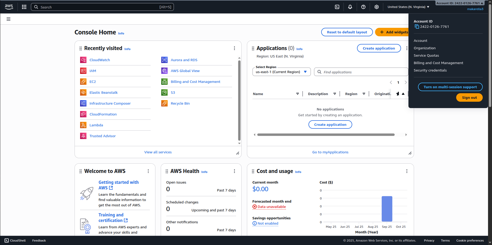
2) IaM Identity Center Admin User 
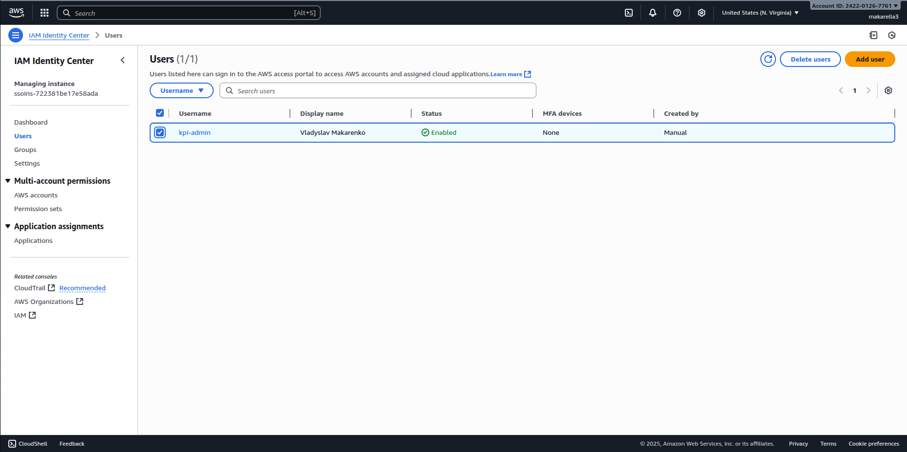
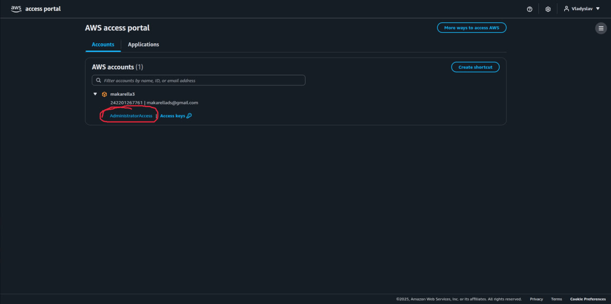

## Завдання 2
1) Organization
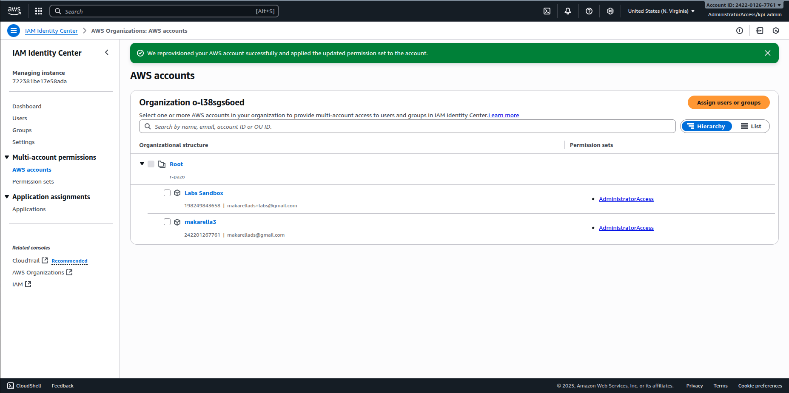

## Завдання 3
1) View only user
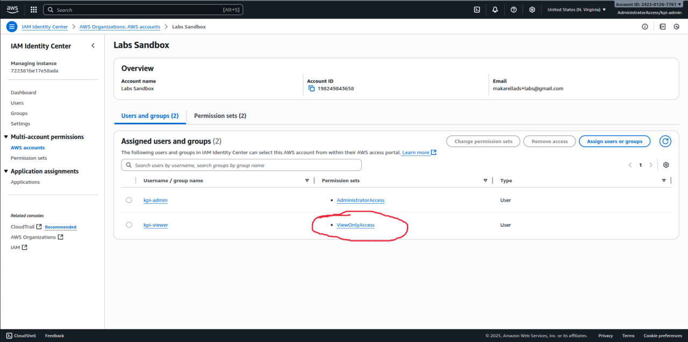

## Завдання 4
1) CF Stack
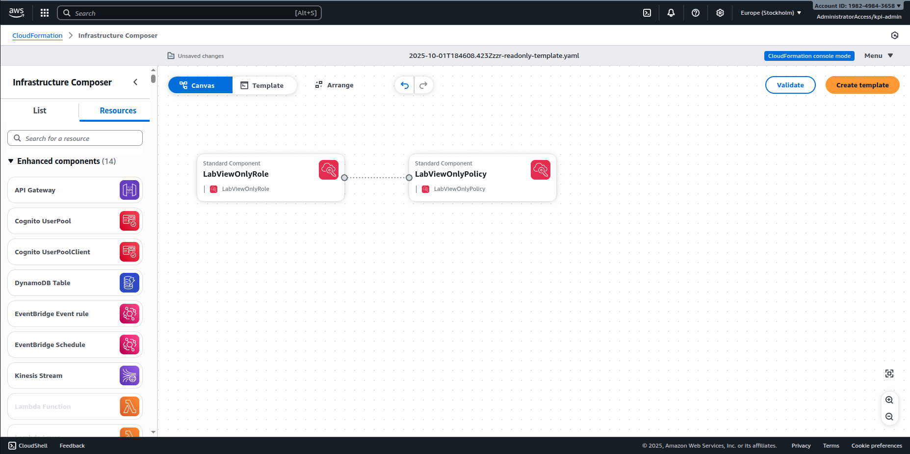
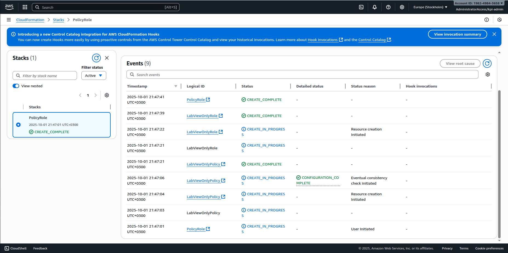

## Завдання 5
1) Resource map
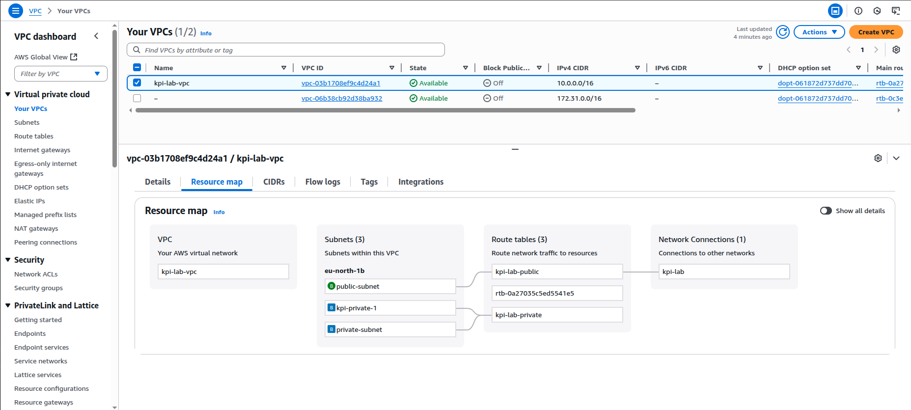
2) Subnets
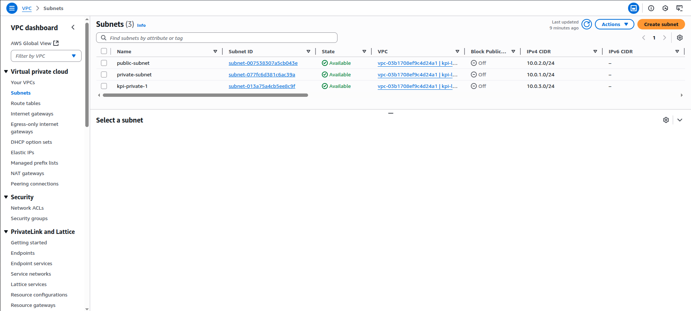
3) Route tables
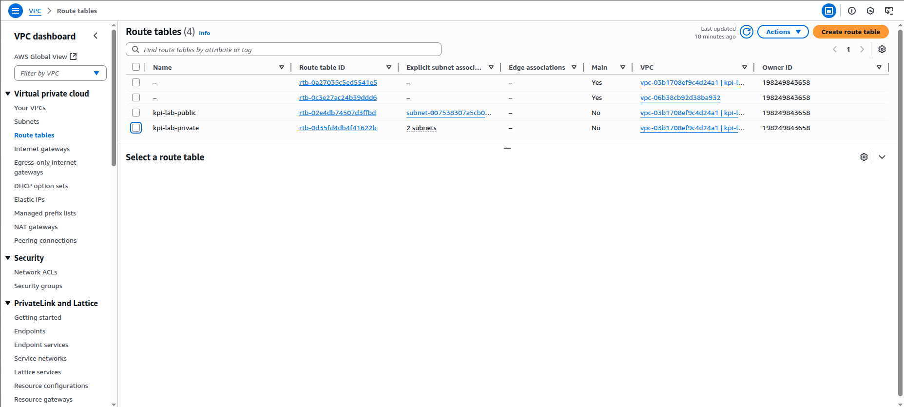
4) IGW
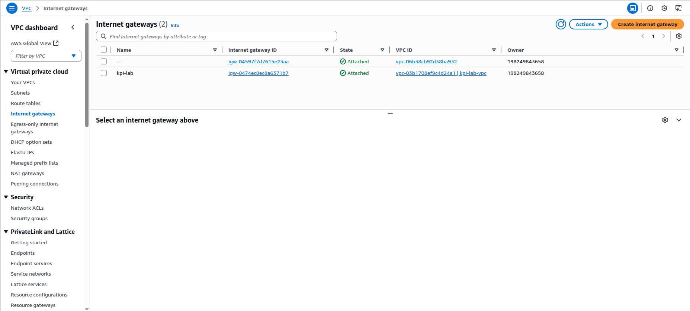
